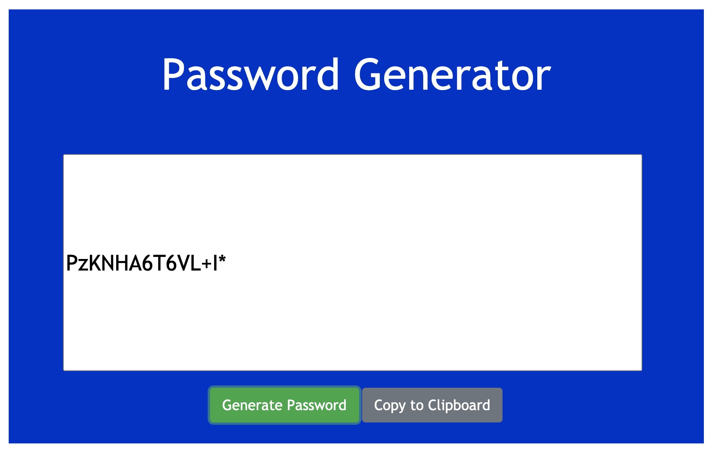

# Password-Generator

A website to generate random passwords with the option to add capital letters, numbers, and/or special characters. Once password is generated, user can copy to clipboard for easy saving.

## Test it out [here](https://rosebourn.github.io/Password-Generator/)

Click on "Generate Password" to get started. Answer prompts about what type of password you would like. Once completed, password will appear in the center box. If you would like to save the password, click "Copy to Clipboard" and paste where you would like.

## Technologies

- HTML
- CSS
- JavaScript
- Bootstrap

<!--  -->

<!-- 

 -->

